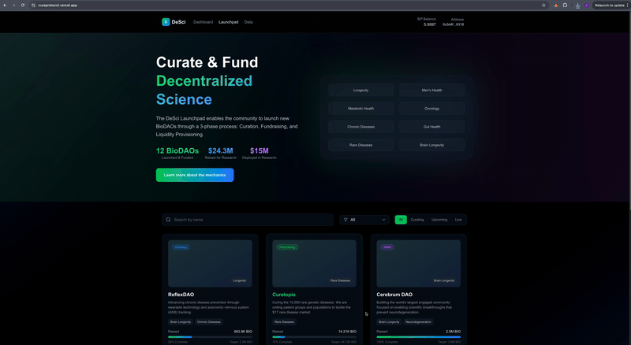

# Cure Protocol

A decentralized science (DeSci) platform dedicated to accelerating innovation and democratizing research. Cure Protocol provides a transparent, community-driven ecosystem where researchers can secure funding, share data, and collaborate on the next wave of scientific breakthroughs. By leveraging Story Protocol's IP infrastructure, Cure Protocol enables researchers to tokenize their intellectual property, fractionalize research assets, and create sustainable funding mechanisms through community-driven curation and staking mechanisms.

## 🌐 Live Platform

**Visit the live platform**: [https://cureprotocol.vercel.app/](https://cureprotocol.vercel.app/)

## 🚀 Overview

Cure Protocol is built on Story Protocol and enables communities to curate, fund, and launch CureDAOs. The platform consists of:

- **Smart Contracts**: Solidity contracts for curation, fundraising, and staking mechanisms
- **Frontend**: Next.js application with modern UI/UX for project discovery and interaction
- **Integration**: Seamless integration with Story Protocol for IP management and licensing

## 🏗️ Architecture

### Core Components

- **AscCurate**: Manages the deposit and refund of $IP tokens for projects
- **AscCurateFactory**: Deploys new AscCurate instances for individual projects
- **AscStaking**: Distributes IP revenue to fractionalized token stakers
- **Frontend**: React/Next.js application with Tailwind CSS and Framer Motion

### Workflow

1. **Curation**: Researchers submit proposals for community review and voting
2. **Fundraising**: Backers contribute funds and receive project-specific tokens
3. **AMM Launch**: Automated Market Maker provides liquidity for token trading
4. **Staking & Governance**: Token holders stake tokens for rewards and governance participation

## 🛠️ Development Setup

### Prerequisites

- Node.js (v18 or higher)
- npm or yarn
- Foundry (for smart contract development)
- Git

### Quick Start with Makefile

The project includes a comprehensive Makefile for easy development workflow management:

```bash
# Complete development setup
make setup

# Quick development workflow (clean, install, build, start dev server)
make dev-workflow

# Production build
make prod
```

### Environment Setup

Create a `.env` file in the root directory with the following variables for deployment:

```env
ADMIN=your_admin_address
PK=your_private_key
```

## 📁 Project Structure

```
asclepius-monorepo/
├── contracts/           # Smart contracts and Foundry configuration
│   ├── contracts/       # Solidity contract implementations
│   ├── test/           # Contract tests
│   ├── script/         # Deployment scripts
│   └── abi/           # Contract ABIs
├── frontend/           # Next.js frontend application
│   ├── src/           # Source code
│   ├── public/        # Static assets
│   └── components/    # React components
└── abi/              # Shared contract ABIs
```

## 🎥 Demo Videos

### Curation and Staking Flow


_Complete walkthrough of the curation process and staking mechanisms, showcasing how users can participate in project curation and earn rewards through staking._

### Data Download Flow



_Demonstration of the data download functionality, showing how users can access and download research datasets and project information._

### Available Makefile Commands

| Command        | Description                                           |
| -------------- | ----------------------------------------------------- |
| `make all`     | Clean, install, and build everything                  |
| `make clean`   | Remove all build artifacts and dependencies           |
| `make install` | Install all dependencies (contracts, frontend, forge) |
| `make build`   | Build all smart contracts                             |
| `make test`    | Run all contract tests (including integration tests)  |
| `make format`  | Format Solidity code and fix frontend linting         |
| `make abi`     | Generate ABIs for all core contracts                  |
| `make lint`    | Lint Solidity and frontend code                       |
| `make anvil`   | Start local anvil node for development                |
| `make dev`     | Start frontend development server                     |
| `make deploy`  | Deploy contracts to mainnet (requires .env)           |

### Manual Development Setup

#### Frontend Development

1. **Navigate to the frontend directory**

   ```bash
   cd frontend
   ```

2. **Install dependencies**

   ```bash
   npm install
   ```

3. **Start the development server**

   ```bash
   npm run dev
   ```

4. **Open your browser**
   ```
   http://localhost:3000
   ```

#### Smart Contract Development

1. **Navigate to the contracts directory**

   ```bash
   cd contracts
   ```

2. **Install dependencies**

   ```bash
   yarn install
   ```

3. **Build contracts**

   ```bash
   forge build
   ```

4. **Run tests**

   ```bash
   forge test
   ```

5. **Run linting**
   ```bash
   npm run lint
   ```

## 🤝 Contributing

1. Fork the repository
2. Create a feature branch (`git checkout -b feature/amazing-feature`)
3. Commit your changes (`git commit -m 'Add some amazing feature'`)
4. Push to the branch (`git push origin feature/amazing-feature`)
5. Open a Pull Request

## 📄 License

This project is licensed under the MIT License - see the [LICENSE](LICENSE) file for details.

## 🔗 Links

- **Live Platform**: [https://cureprotocol.vercel.app/](https://cureprotocol.vercel.app/)
- [Story Protocol](https://storyprotocol.xyz/)
